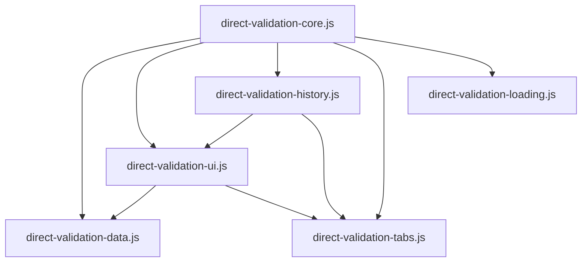
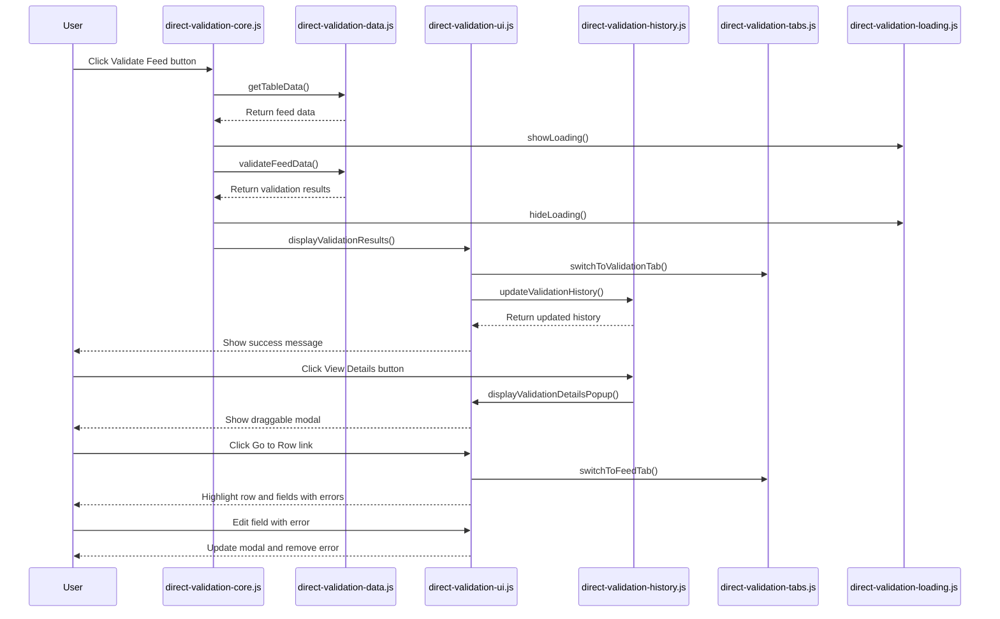

# Direct Validation Module Refactoring Implementation Plan

## 1. Project Setup and Preparation

### 1.1 Create Module Files
- Create the six new module files in the src/popup directory:
  - direct-validation-core.js
  - direct-validation-data.js
  - direct-validation-ui.js
  - direct-validation-history.js
  - direct-validation-tabs.js
  - direct-validation-loading.js

### 1.2 Create Feature Flag System
- Create a feature-flags.js file to control the transition between old and new implementations
- Implement flags for each module to allow granular control over which parts use the new implementation

```javascript
// feature-flags.js
window.DIRECT_VALIDATION_FLAGS = {
  USE_NEW_CORE: false,
  USE_NEW_DATA: false,
  USE_NEW_UI: false,
  USE_NEW_HISTORY: false,
  USE_NEW_TABS: false,
  USE_NEW_LOADING: false,
  USE_NEW_ALL: false  // Master switch
};
```

### 1.3 Update HTML to Load New Files
- Modify popup.html to load the feature flags and new module files
- Ensure they're loaded in the correct order (feature flags first, then modules, then original file)

```html
<!-- Feature flags -->
<script src="feature-flags.js"></script>

<!-- New modular implementation -->
<script src="direct-validation-loading.js"></script>
<script src="direct-validation-tabs.js"></script>
<script src="direct-validation-data.js"></script>
<script src="direct-validation-ui.js"></script>
<script src="direct-validation-history.js"></script>
<script src="direct-validation-core.js"></script>

<!-- Original implementation (will be removed eventually) -->
<script src="direct_validation.js"></script>
```

## 2. Module Implementation

### 2.1 direct-validation-loading.js
- Extract loading indicator functions from direct_validation.js
- Implement feature flag check to determine which implementation to use

```javascript
// direct-validation-loading.js
(function() {
  // Original functions from direct_validation.js
  function showLoading(message) {
    // Implementation from original file
  }
  
  function hideLoading() {
    // Implementation from original file
  }
  
  // Export functions to global scope
  window.DirectValidationLoading = {
    showLoading: function(message) {
      if (window.DIRECT_VALIDATION_FLAGS.USE_NEW_LOADING || window.DIRECT_VALIDATION_FLAGS.USE_NEW_ALL) {
        return showLoading(message);
      }
      // Otherwise, do nothing (original implementation will handle it)
    },
    hideLoading: function() {
      if (window.DIRECT_VALIDATION_FLAGS.USE_NEW_LOADING || window.DIRECT_VALIDATION_FLAGS.USE_NEW_ALL) {
        return hideLoading();
      }
      // Otherwise, do nothing (original implementation will handle it)
    }
  };
})();
```

### 2.2 direct-validation-tabs.js
- Extract tab switching functions from direct_validation.js
- Implement feature flag check to determine which implementation to use

```javascript
// direct-validation-tabs.js
(function() {
  // Original functions from direct_validation.js
  function switchToValidationTab() {
    // Implementation from original file
  }
  
  function switchToFeedTab() {
    // Implementation from original file
  }
  
  // Export functions to global scope
  window.DirectValidationTabs = {
    switchToValidationTab: function() {
      if (window.DIRECT_VALIDATION_FLAGS.USE_NEW_TABS || window.DIRECT_VALIDATION_FLAGS.USE_NEW_ALL) {
        return switchToValidationTab();
      }
      // Otherwise, do nothing (original implementation will handle it)
    },
    switchToFeedTab: function() {
      if (window.DIRECT_VALIDATION_FLAGS.USE_NEW_TABS || window.DIRECT_VALIDATION_FLAGS.USE_NEW_ALL) {
        return switchToFeedTab();
      }
      // Otherwise, do nothing (original implementation will handle it)
    }
  };
})();
```

### 2.3 direct-validation-data.js
- Extract data retrieval and processing functions from direct_validation.js
- Implement feature flag check to determine which implementation to use

```javascript
// direct-validation-data.js
(function() {
  // Original functions from direct_validation.js
  function getTableData() {
    // Implementation from original file
  }
  
  function validateFeedData(feedData) {
    // Implementation from original file
  }
  
  // Export functions to global scope
  window.DirectValidationData = {
    getTableData: function() {
      if (window.DIRECT_VALIDATION_FLAGS.USE_NEW_DATA || window.DIRECT_VALIDATION_FLAGS.USE_NEW_ALL) {
        return getTableData();
      }
      // Otherwise, do nothing (original implementation will handle it)
    },
    validateFeedData: function(feedData) {
      if (window.DIRECT_VALIDATION_FLAGS.USE_NEW_DATA || window.DIRECT_VALIDATION_FLAGS.USE_NEW_ALL) {
        return validateFeedData(feedData);
      }
      // Otherwise, do nothing (original implementation will handle it)
    }
  };
})();
```

### 2.4 direct-validation-ui.js
- Extract UI-related functions from direct_validation.js
- Implement feature flag check to determine which implementation to use

```javascript
// direct-validation-ui.js
(function() {
  // Original functions from direct_validation.js
  function displayValidationResults(results) {
    // Implementation from original file
  }
  
  function formatIssuesList(issues) {
    // Implementation from original file
  }
  
  function setupRowNavigation(panel) {
    // Implementation from original file
  }
  
  function displayValidationDetailsPopup(results) {
    // Implementation from original file
  }
  
  // Export functions to global scope
  window.DirectValidationUI = {
    displayValidationResults: function(results) {
      if (window.DIRECT_VALIDATION_FLAGS.USE_NEW_UI || window.DIRECT_VALIDATION_FLAGS.USE_NEW_ALL) {
        return displayValidationResults(results);
      }
      // Otherwise, do nothing (original implementation will handle it)
    },
    formatIssuesList: function(issues) {
      if (window.DIRECT_VALIDATION_FLAGS.USE_NEW_UI || window.DIRECT_VALIDATION_FLAGS.USE_NEW_ALL) {
        return formatIssuesList(issues);
      }
      // Otherwise, do nothing (original implementation will handle it)
    },
    setupRowNavigation: function(panel) {
      if (window.DIRECT_VALIDATION_FLAGS.USE_NEW_UI || window.DIRECT_VALIDATION_FLAGS.USE_NEW_ALL) {
        return setupRowNavigation(panel);
      }
      // Otherwise, do nothing (original implementation will handle it)
    },
    displayValidationDetailsPopup: function(results) {
      if (window.DIRECT_VALIDATION_FLAGS.USE_NEW_UI || window.DIRECT_VALIDATION_FLAGS.USE_NEW_ALL) {
        return displayValidationDetailsPopup(results);
      }
      // Otherwise, do nothing (original implementation will handle it)
    }
  };
})();
```

### 2.5 direct-validation-history.js
- Extract validation history functions from direct_validation.js
- Implement feature flag check to determine which implementation to use

```javascript
// direct-validation-history.js
(function() {
  // Original functions from direct_validation.js
  function updateValidationHistory(results) {
    // Implementation from original file
  }
  
  function createValidationHistoryTable(results) {
    // Implementation from original file
  }
  
  function updateValidationHistoryWithElement(historyTableBody, results) {
    // Implementation from original file
  }
  
  // Export functions to global scope
  window.DirectValidationHistory = {
    updateValidationHistory: function(results) {
      if (window.DIRECT_VALIDATION_FLAGS.USE_NEW_HISTORY || window.DIRECT_VALIDATION_FLAGS.USE_NEW_ALL) {
        return updateValidationHistory(results);
      }
      // Otherwise, do nothing (original implementation will handle it)
    },
    createValidationHistoryTable: function(results) {
      if (window.DIRECT_VALIDATION_FLAGS.USE_NEW_HISTORY || window.DIRECT_VALIDATION_FLAGS.USE_NEW_ALL) {
        return createValidationHistoryTable(results);
      }
      // Otherwise, do nothing (original implementation will handle it)
    },
    updateValidationHistoryWithElement: function(historyTableBody, results) {
      if (window.DIRECT_VALIDATION_FLAGS.USE_NEW_HISTORY || window.DIRECT_VALIDATION_FLAGS.USE_NEW_ALL) {
        return updateValidationHistoryWithElement(historyTableBody, results);
      }
      // Otherwise, do nothing (original implementation will handle it)
    }
  };
})();
```

### 2.6 direct-validation-core.js
- Extract core functions from direct_validation.js
- Implement feature flag check to determine which implementation to use
- Set up event listeners that use the new modular implementation when feature flags are enabled

```javascript
// direct-validation-core.js
(function() {
  // Original functions from direct_validation.js
  function handleDirectValidation() {
    console.log('[DIRECT-NEW] Validate Feed button clicked');
    
    // Use the new modular implementation
    const feedData = window.DirectValidationData.getTableData();
    
    if (!feedData || !feedData.length) {
      alert('Please load a feed first before validating.');
      return;
    }
    
    console.log('[DIRECT-NEW] Validating feed data with', feedData.length, 'rows');
    
    // Show loading indicator
    window.DirectValidationLoading.showLoading('Validating feed...');
    
    // Simulate validation process
    setTimeout(() => {
      // Perform basic validation
      const validationResults = window.DirectValidationData.validateFeedData(feedData);
      
      // Hide loading indicator
      window.DirectValidationLoading.hideLoading();
      
      // Display validation results
      window.DirectValidationUI.displayValidationResults(validationResults);
      
      console.log('[DIRECT-NEW] Validation complete');
    }, 1000); // Simulate processing time
  }
  
  // Initialize event listeners if using new implementation
  function initializeEventListeners() {
    console.log('[DIRECT-NEW] Adding direct event listener to Validate Feed button');
    
    // Wait for DOM to be ready
    document.addEventListener('DOMContentLoaded', function() {
      const validateButton = document.getElementById('validateGMC');
      
      if (validateButton) {
        console.log('[DIRECT-NEW] Found Validate Feed button, adding click listener');
        validateButton.addEventListener('click', handleDirectValidation);
      } else {
        console.error('[DIRECT-NEW] Validate Feed button not found');
      }
    });
  }
  
  // Export functions to global scope
  window.DirectValidationCore = {
    handleDirectValidation: function() {
      if (window.DIRECT_VALIDATION_FLAGS.USE_NEW_CORE || window.DIRECT_VALIDATION_FLAGS.USE_NEW_ALL) {
        return handleDirectValidation();
      }
      // Otherwise, do nothing (original implementation will handle it)
    },
    initialize: function() {
      if (window.DIRECT_VALIDATION_FLAGS.USE_NEW_CORE || window.DIRECT_VALIDATION_FLAGS.USE_NEW_ALL) {
        initializeEventListeners();
      }
    }
  };
  
  // Initialize if using new implementation
  if (window.DIRECT_VALIDATION_FLAGS.USE_NEW_CORE || window.DIRECT_VALIDATION_FLAGS.USE_NEW_ALL) {
    window.DirectValidationCore.initialize();
  }
})();
```

### 2.7 Modify direct_validation.js
- Add feature flag check to prevent duplicate event listeners
- This change should only be made after all modules are implemented and tested

```javascript
// Modified direct_validation.js
(function() {
  // Only initialize if not using new implementation
  if (!window.DIRECT_VALIDATION_FLAGS.USE_NEW_CORE && !window.DIRECT_VALIDATION_FLAGS.USE_NEW_ALL) {
    console.log('[DIRECT] Adding direct event listener to Validate Feed button');
    
    // Wait for DOM to be ready
    document.addEventListener('DOMContentLoaded', function() {
      const validateButton = document.getElementById('validateGMC');
      
      if (validateButton) {
        console.log('[DIRECT] Found Validate Feed button, adding click listener');
        validateButton.addEventListener('click', handleDirectValidation);
      } else {
        console.error('[DIRECT] Validate Feed button not found');
      }
    });
  }
  
  // Rest of the original implementation...
})();
```

## 3. Testing Strategy

### 3.1 Unit Testing
- Create unit tests for each module to ensure they work correctly in isolation
- Test edge cases and error handling
- Use Jest for testing

```javascript
// Example unit test for direct-validation-data.js
describe('DirectValidationData', () => {
  describe('getTableData', () => {
    it('should return an empty array if the table is not found', () => {
      // Setup: Ensure no table exists
      document.body.innerHTML = '<div></div>';
      
      // Execute
      const result = window.DirectValidationData.getTableData();
      
      // Verify
      expect(result).toEqual([]);
    });
    
    it('should extract data from the preview table', () => {
      // Setup: Create a mock table
      document.body.innerHTML = `
        <div id="previewContent">
          <table>
            <thead>
              <tr>
                <th>title</th>
                <th>description</th>
              </tr>
            </thead>
            <tbody>
              <tr>
                <td>Product 1</td>
                <td>Description 1</td>
              </tr>
            </tbody>
          </table>
        </div>
      `;
      
      // Execute
      const result = window.DirectValidationData.getTableData();
      
      // Verify
      expect(result).toEqual([
        {
          title: 'Product 1',
          description: 'Description 1',
          rowIndex: 1
        }
      ]);
    });
  });
  
  // More tests...
});
```

### 3.2 Integration Testing
- Create integration tests to ensure modules work together correctly
- Test the entire validation flow from button click to results display
- Use Jest for testing

```javascript
// Example integration test
describe('Direct Validation Integration', () => {
  it('should validate feed data and display results', () => {
    // Setup: Create a mock table and validation history
    document.body.innerHTML = `
      <div id="previewContent">
        <table>
          <thead>
            <tr>
              <th>title</th>
              <th>description</th>
            </tr>
          </thead>
          <tbody>
            <tr>
              <td>Short Title</td>
              <td>Short Description</td>
            </tr>
          </tbody>
        </table>
      </div>
      <div id="validation-tab">
        <table class="validation-table">
          <tbody id="validationHistory"></tbody>
        </table>
      </div>
      <button id="validateGMC">Validate Feed</button>
    `;
    
    // Mock tab switching
    window.DirectValidationTabs.switchToValidationTab = jest.fn();
    
    // Execute: Trigger validation
    window.DirectValidationCore.handleDirectValidation();
    
    // Fast-forward timers
    jest.runAllTimers();
    
    // Verify: Check if validation results are displayed
    expect(window.DirectValidationTabs.switchToValidationTab).toHaveBeenCalled();
    expect(document.querySelector('#validationHistory tr')).not.toBeNull();
    expect(document.querySelector('#validationHistory tr td:nth-child(3)').textContent).toContain('Invalid');
  });
});
```

### 3.3 Manual Testing
- Create a test plan for manual testing
- Test each module individually and together
- Test with different feature flag configurations
- Test the critical draggable modal functionality thoroughly

#### Manual Test Plan

1. **Basic Functionality**
   - Verify that the Validate Feed button works
   - Verify that validation results are displayed in the Validation History tab
   - Verify that the View Details button works
   - Verify that the draggable modal appears and can be dragged
   - Verify that row navigation from the modal works
   - Verify that error highlighting works
   - Verify that error removal when fixed works

2. **Feature Flag Testing**
   - Test with all feature flags disabled (should use original implementation)
   - Test with each feature flag enabled individually
   - Test with all feature flags enabled (should use new implementation)
   - Test with various combinations of feature flags

3. **Edge Cases**
   - Test with empty feed data
   - Test with feed data that has no errors
   - Test with feed data that has only title errors
   - Test with feed data that has only description errors
   - Test with feed data that has both title and description errors
   - Test with very large feed data (performance test)

## 4. Implementation Schedule

### 4.1 Phase 1: Setup and Initial Implementation (Week 1)
- Create module files and feature flag system
- Update HTML to load new files
- Implement direct-validation-loading.js and direct-validation-tabs.js
- Write unit tests for these modules
- Test with feature flags

### 4.2 Phase 2: Core Functionality (Week 2)
- Implement direct-validation-data.js and direct-validation-ui.js
- Write unit tests for these modules
- Test with feature flags

### 4.3 Phase 3: History and Core (Week 3)
- Implement direct-validation-history.js and direct-validation-core.js
- Write unit tests for these modules
- Test with feature flags

### 4.4 Phase 4: Integration and Testing (Week 4)
- Write integration tests
- Perform manual testing
- Fix any issues found during testing
- Modify direct_validation.js to check feature flags

### 4.5 Phase 5: Deployment and Monitoring (Week 5)
- Deploy with all feature flags disabled
- Gradually enable feature flags for a small percentage of users
- Monitor for issues
- Increase percentage of users with feature flags enabled
- Eventually enable all feature flags for all users

### 4.6 Phase 6: Cleanup (Week 6)
- Remove feature flags
- Remove original direct_validation.js
- Update HTML to only load the new modules

## 5. Risk Mitigation

### 5.1 Preview Feed Functionality
- The Preview Feed functionality is handled separately from the validation functionality
- The refactoring should not affect it
- However, we'll verify that the Preview Feed continues to work correctly after each phase

### 5.2 Draggable Modal
- The draggable modal is a critical component of the validation flow
- We'll test it thoroughly after implementing direct-validation-ui.js
- We'll ensure it maintains all functionality:
  - Proper creation and positioning
  - Draggability
  - Row navigation links
  - Error highlighting and removal
  - Real-time updates when errors are fixed

### 5.3 Feature Flags
- Feature flags allow for easy rollback if issues arise
- We'll test with different feature flag configurations
- We'll deploy with all feature flags disabled initially
- We'll gradually enable feature flags for a small percentage of users
- We'll monitor for issues and address them before increasing the percentage

### 5.4 Comprehensive Testing
- Unit tests for each module
- Integration tests for the entire validation flow
- Manual testing with different feature flag configurations
- Testing of edge cases and error handling

## 6. Module Dependency and Validation Flow

### 6.1 Module Dependency Diagram



### 6.2 Validation Flow Diagram



## 7. Conclusion

This implementation plan provides a detailed roadmap for refactoring the direct_validation.js file into smaller, more focused modules. By following this plan, we can ensure that:

1. The refactoring is done incrementally, with thorough testing after each phase
2. Existing functionality, especially the Preview Feed feature, remains unaffected
3. The critical draggable modal functionality is preserved
4. Feature flags allow for easy rollback if issues arise
5. The transition to the new implementation is gradual and controlled

The end result will be a more maintainable, organized, and testable codebase that preserves all existing functionality while providing a better foundation for future enhancements.