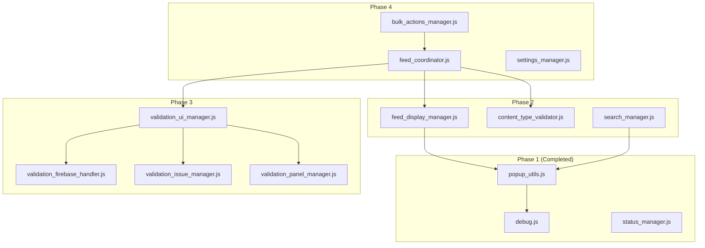
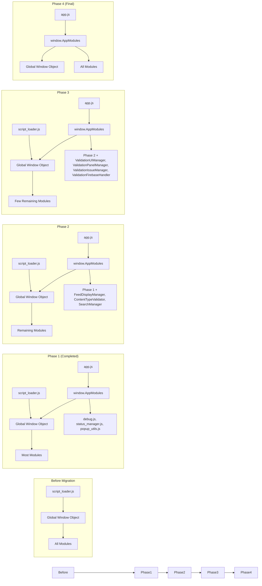
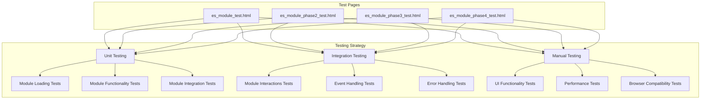

# ES Module Migration Diagram

This document provides visual diagrams to help understand the ES module migration plan for the AdBrain Feed Manager extension.

## Module Dependencies

The following diagram shows the dependencies between the key modules in the AdBrain Feed Manager extension:

## Migration Process

The following diagram shows the process of migrating from script_loader.js to ES modules:

## Testing Strategy

The following diagram shows the testing strategy for each phase of the migration:

These diagrams provide a visual representation of the ES module migration plan, showing the dependencies between modules, the migration process, and the testing strategy for each phase.