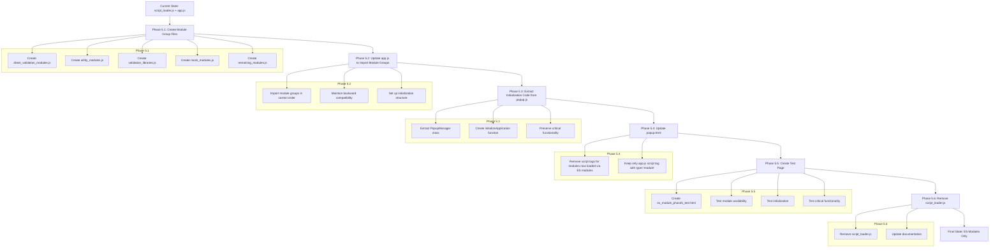

# ES Module Migration Phase 5 Diagrams

This document contains diagrams to visualize the module dependencies and migration plan for Phase 5 of the ES Module Migration.

## Current Module Structure

```mermaid
graph TD
    subgraph "Script Loading System"
        SL[script_loader.js]
    end

    subgraph "Entry Point"
        APP[app.js]
    end

    subgraph "Utility Modules"
        DEBUG[debug.js]
        UTILS[popup_utils.js]
        STATUS[status_manager.js]
    end

    subgraph "Manager Modules"
        MM[manager_modules.js]
        FC[feed_coordinator.js]
        SM[settings_manager.js]
        BAM[bulk_actions_manager.js]
    end

    subgraph "Validation Modules"
        VM[validation_modules.js]
        VFH[validation_firebase_handler.js]
        VIM[validation_issue_manager.js]
        VPM[validation_panel_manager.js]
        VUM[validation_ui_manager.js]
    end

    subgraph "Display Modules"
        FDM[feed_display_manager.js]
        CTV[content_type_validator.js]
        SEARCH[search_manager.js]
    end

    subgraph "Remaining Modules"
        SBM[status_bar_manager.js]
        PEH[popup_event_handlers.js]
        PMH[popup_message_handler.js]
        PC[popup_config.js]
        POPUP[popup.js]
    end

    subgraph "Direct Validation Modules"
        DVM[direct-validation-monitor.js]
        DVL[direct-validation-loading.js]
        DVT[direct-validation-tabs.js]
        DVD[direct-validation-data.js]
        DVUI[direct-validation-ui.js]
        DVH[direct-validation-history.js]
        DVC[direct-validation-core.js]
    end

    subgraph "Library Modules"
        LOADING[lib/ui/loading.js]
        ERRORS[lib/ui/errors.js]
        TABLES[lib/ui/tables.js]
        RULES[lib/validation/rules.js]
        ANALYZER[lib/validation/analyzer.js]
        CRV[lib/validation/custom_rule_validator.js]
        GMCV[lib/gmc/validator.js]
    end

    subgraph "Mock Modules"
        FM[firebase_mock.js]
        GMCM[gmc_mock.js]
        AM[auth_mock.js]
        UIM[ui_mocks.js]
    end

    SL --> DEBUG
    SL --> UTILS
    SL --> STATUS
    SL --> FC
    SL --> SM
    SL --> BAM
    SL --> VFH
    SL --> VIM
    SL --> VPM
    SL --> VUM
    SL --> FDM
    SL --> CTV
    SL --> SEARCH
    SL --> SBM
    SL --> PEH
    SL --> PMH
    SL --> PC
    SL --> POPUP
    SL --> DVM
    SL --> DVL
    SL --> DVT
    SL --> DVD
    SL --> DVUI
    SL --> DVH
    SL --> DVC
    SL --> LOADING
    SL --> ERRORS
    SL --> TABLES
    SL --> RULES
    SL --> ANALYZER
    SL --> CRV
    SL --> GMCV
    SL --> FM
    SL --> GMCM
    SL --> AM
    SL --> UIM

    APP --> DEBUG
    APP --> UTILS
    APP --> STATUS
    APP --> MM
    APP --> VM
    APP --> FDM
    APP --> CTV
    APP --> SEARCH

    MM --> FC
    MM --> SM
    MM --> BAM

    VM --> VFH
    VM --> VIM
    VM --> VPM
    VM --> VUM

    POPUP --> FC
    POPUP --> VUM
    POPUP --> SBM
    POPUP --> SEARCH
    POPUP --> SM
    POPUP --> BAM
    POPUP --> PEH
    POPUP --> PMH
```



## Target Module Structure

```mermaid
graph TD
    subgraph "Entry Point"
        APP[app.js]
    end

    subgraph "Module Groups"
        UM[utility_modules.js]
        VL[validation_libraries.js]
        MM[manager_modules.js]
        VM[validation_modules.js]
        DVM[direct_validation_modules.js]
        MOCK[mock_modules.js]
        RM[remaining_modules.js]
    end

    subgraph "Utility Modules"
        DEBUG[debug.js]
        UTILS[popup_utils.js]
        STATUS[status_manager.js]
        LOADING[lib/ui/loading.js]
        ERRORS[lib/ui/errors.js]
        TABLES[lib/ui/tables.js]
        LI[loading-indicator.js]
    end

    subgraph "Validation Libraries"
        RULES[lib/validation/rules.js]
        ANALYZER[lib/validation/analyzer.js]
        CRV[lib/validation/custom_rule_validator.js]
        GMCV[lib/gmc/validator.js]
    end

    subgraph "Manager Modules"
        FC[feed_coordinator.js]
        SM[settings_manager.js]
        BAM[bulk_actions_manager.js]
    end

    subgraph "Validation Modules"
        VFH[validation_firebase_handler.js]
        VIM[validation_issue_manager.js]
        VPM[validation_panel_manager.js]
        VUM[validation_ui_manager.js]
    end

    subgraph "Display Modules"
        FDM[feed_display_manager.js]
        CTV[content_type_validator.js]
        SEARCH[search_manager.js]
    end

    subgraph "Remaining Modules"
        SBM[status_bar_manager.js]
        PEH[popup_event_handlers.js]
        PMH[popup_message_handler.js]
        PC[popup_config.js]
    end

    subgraph "Direct Validation Modules"
        DVMON[direct-validation-monitor.js]
        DVL[direct-validation-loading.js]
        DVT[direct-validation-tabs.js]
        DVD[direct-validation-data.js]
        DVUI[direct-validation-ui.js]
        DVH[direct-validation-history.js]
        DVC[direct-validation-core.js]
    end

    subgraph "Mock Modules"
        FM[firebase_mock.js]
        GMCM[gmc_mock.js]
        AM[auth_mock.js]
        UIM[ui_mocks.js]
    end

    APP --> UM
    APP --> DEBUG
    APP --> UTILS
    APP --> STATUS
    APP --> VL
    APP --> MOCK
    APP --> CTV
    APP --> FDM
    APP --> SEARCH
    APP --> VM
    APP --> MM
    APP --> RM
    APP --> DVM

    UM --> LOADING
    UM --> ERRORS
    UM --> TABLES
    UM --> LI

    VL --> RULES
    VL --> ANALYZER
    VL --> CRV
    VL --> GMCV

    MM --> FC
    MM --> SM
    MM --> BAM

    VM --> VFH
    VM --> VIM
    VM --> VPM
    VM --> VUM

    DVM --> DVMON
    DVM --> DVL
    DVM --> DVT
    DVM --> DVD
    DVM --> DVUI
    DVM --> DVH
    DVM --> DVC

    MOCK --> FM
    MOCK --> GMCM
    MOCK --> AM
    MOCK --> UIM

    RM --> SBM
    RM --> PEH
    RM --> PMH
    RM --> PC
```



## Migration Process



## Critical Functionality Preservation

```mermaid
flowchart TD
    A[Critical Functionality] --> B[CSV File Upload and Preview]
    A --> C[Validation Workflow]

    subgraph "CSV File Upload and Preview"
        B1[Upload CSV File]
        B2[Display Feed in Color Tables]
    end

    subgraph "Validation Workflow"
        C1[Validate Feed Button]
        C2[Navigation to Validation History Tab]
        C3[View Details Modal]
        C4[Row Navigation]
        C5[Row Highlighting]
        C6[Error Removal]
        C7[Scrollable Modal]
    end

    B --> B1
    B --> B2

    C --> C1
    C --> C2
    C --> C3
    C --> C4
    C --> C5
    C --> C6
    C --> C7

    subgraph "Testing Strategy"
        T1[Module Availability Tests]
        T2[Initialization Tests]
        T3[Functionality Tests]
        T4[Edge Case Tests]
    end

    T1 --> B
    T1 --> C
    T2 --> B
    T2 --> C
    T3 --> B
    T3 --> C
    T4 --> B
    T4 --> C