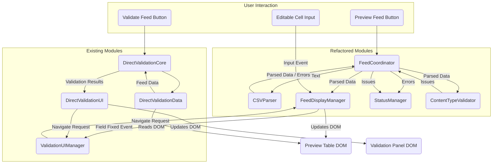

# Feed Manager Refactoring Plan (Refined)

## Goal

Refactor the monolithic `src/popup/feed_manager.js` into modular components to improve maintainability, testability, and fix integration issues (like the content type validation dependency). The refactoring must preserve 100% of the existing functionality and user interface behavior, including compatibility with the separate `direct-validation-*` modules.

## Current Status (April 28, 2025)

### Progress Made
1. **CSVParser Module Created**: The `src/popup/csv_parser.js` module has been created and implements CSV parsing, validation, and error detection functionality.
2. **ContentTypeValidator Module Exists**: The `src/popup/content_type_validator.js` module exists but needs better integration.
3. **Documentation Created**: Comprehensive documentation of the current architecture and refactoring plan has been created.

### Remaining Challenges
1. **Integration with FeedManager**: The CSVParser module needs to be properly integrated with the FeedManager.
2. **Remaining Modules**: The other planned modules (FeedDisplayManager, StatusManager) still need to be extracted.
3. **Critical Functionality**: The validation workflow (CSV upload, preview, validation, error display, navigation, and fixing) must be preserved.

## Proposed Modules

1. **`CSVParser`** (Partially Completed):
   - Responsible for parsing CSV text and validating its structure (headers, columns, quotes).
   - Current implementation includes:
     - CSV parsing with error handling
     - Structure validation (headers, column counts)
     - Integration with ContentTypeValidator
   - Needs:
     - Better error handling and reporting
     - Cleaner integration with FeedManager
     - Comprehensive unit tests

2. **`ContentTypeValidator`** (Exists but Needs Integration):
   - Responsible for validating data types within rows (e.g., URL in link field).
   - Current implementation includes:
     - Validators for different column types
     - Validation logic for each field type
     - Formatting of validation issues
   - Needs:
     - Standard module imports instead of global scope
     - Better integration with CSVParser and FeedManager
     - More comprehensive validation rules

3. **`FeedDisplayManager`** (To Be Created):
   - Responsible for rendering parsed data into the HTML table, creating/managing editable cells, character counts, row highlighting, and the floating scrollbar.
   - Will be extracted from:
     - `displayPreview`
     - `createEditableCell`
     - `getCorrectedTableData`
     - `navigateToRow`
     - `initFloatingScrollBar`
     - `sanitizeText`
   - Must provide a way for `DirectValidationData` to get the current table data.
   - Critical for preserving the validation workflow.

4. **`StatusManager`** (To Be Created):
   - Responsible for updating the dedicated "Feed Status" UI area.
   - Will be extracted from:
     - `updateFeedStatus`
     - `initFeedStatusContent`
   - Needs to handle different types of status messages (info, warning, error, success).

5. **`FeedCoordinator`** (Refactored FeedManager):
   - Orchestrates the "Preview Feed" process, using the other modules.
   - Handles button clicks, calls parser, display manager, status manager, and integrates content type validation.
   - Will be the slimmed-down version of the current FeedManager after extraction of other modules.

6. **`ValidationUIManager`** (Existing):
   - Needs careful integration with the refactored modules.
   - Displays validation issues and triggers row navigation in `FeedDisplayManager`.
   - The interaction regarding how inline edits clear validation issues needs to be maintained.

7. **`ScriptLoader`** (Existing):
   - Will be phased out for the refactored modules.
   - Replaced by standard ES Module imports to resolve dependency loading issues.

## Implementation Plan

### Phase 1: Complete CSVParser Module Integration (Current Focus)

1. **Review Current CSVParser Implementation**:
   - Analyze the current implementation in `src/popup/csv_parser.js`
   - Identify any missing functionality or issues
   - Ensure it handles all edge cases from the original implementation

2. **Update FeedManager to Use CSVParser**:
   - Modify `handlePreview` method to use the CSVParser module
   - Replace the `parseCSV` method call with CSVParser
   - Ensure error handling is consistent
   - Test thoroughly to ensure functionality is preserved

3. **Improve ContentTypeValidator Integration**:
   - Update CSVParser to use ContentTypeValidator more effectively
   - Ensure validation issues are properly reported
   - Test with various content types to verify validation works

### Phase 2: Extract StatusManager Module

1. **Create StatusManager Module**:
   - Create `src/popup/status_manager.js`
   - Extract `updateFeedStatus` and `initFeedStatusContent` methods
   - Implement clear interface for status updates
   - Add support for different message types

2. **Update FeedManager to Use StatusManager**:
   - Replace direct status updates with StatusManager calls
   - Ensure all status messages are properly displayed
   - Test thoroughly to ensure functionality is preserved

### Phase 3: Extract FeedDisplayManager Module

1. **Create FeedDisplayManager Module**:
   - Create `src/popup/feed_display_manager.js`
   - Extract display-related methods:
     - `displayPreview`
     - `createEditableCell`
     - `getCorrectedTableData`
     - `navigateToRow`
     - `initFloatingScrollBar`
     - `sanitizeText`
   - Ensure it provides access to table data for DirectValidationData

2. **Update FeedManager to Use FeedDisplayManager**:
   - Replace direct display methods with FeedDisplayManager calls
   - Ensure all UI interactions work correctly
   - Test thoroughly to ensure functionality is preserved

3. **Ensure Validation Integration**:
   - Verify that DirectValidationData can still access table data
   - Ensure row navigation from validation panels works
   - Test the complete validation workflow

### Phase 4: Refactor FeedManager into FeedCoordinator

1. **Slim Down FeedManager**:
   - Remove all extracted functionality
   - Keep only coordination logic
   - Update to use all extracted modules

2. **Implement Clean Module Interfaces**:
   - Define clear interfaces between modules
   - Use standard ES Module imports
   - Remove global scope dependencies

3. **Comprehensive Testing**:
   - Test the entire workflow from CSV upload to validation
   - Verify all functionality works as before
   - Document any issues and their resolutions

### Phase 5: Documentation and Cleanup

1. **Update Documentation**:
   - Update module documentation
   - Document the new architecture
   - Create developer guides for future extensions

2. **Code Cleanup**:
   - Remove deprecated code
   - Clean up comments and debug logs
   - Optimize performance where possible

3. **Final Testing**:
   - Perform end-to-end testing
   - Verify all critical functionality works
   - Document the final state of the refactoring

## Critical Functionality to Preserve

Based on the user's concerns, the following functionality is critical to preserve:

1. **CSV File Upload and Preview**:
   - Ability to upload a CSV file
   - Display the feed in color tables with all columns and rows

2. **Validation Workflow**:
   - "Validate Feed" button functionality
   - Navigation to validation history tab with summary of feed errors
   - "View Details" button that shows a modal with all errors
   - Clickable links in the modal to navigate to rows with errors
   - Row highlighting that persists until errors are fixed
   - Error removal from the modal when fixed
   - Scrollable modal with sticky header that is draggable or closable

## Diagram of Proposed Interaction

## Testing Strategy

1. **Unit Testing**:
   - Test each module in isolation
   - Mock dependencies
   - Verify expected behavior

2. **Integration Testing**:
   - Test modules working together
   - Verify end-to-end functionality

3. **UI Testing**:
   - Compare UI before and after refactoring
   - Verify identical appearance and behavior

4. **User Workflow Testing**:
   - Test all user workflows
   - Verify identical behavior

## Risk Mitigation

1. **Incremental Approach**:
   - Refactor one module at a time
   - Test thoroughly after each step
   - Roll back if issues are found

2. **Comprehensive Testing**:
   - Test before, during, and after refactoring
   - Automate tests where possible

3. **Clear Documentation**:
   - Document the new architecture
   - Document module interactions
   - Create a migration guide

4. **Performance Monitoring**:
   - Monitor performance during refactoring
   - Optimize as needed

## Next Steps (For Code Mode)

1. **Complete CSVParser Integration**:
   - Update FeedManager's `handlePreview` method to use CSVParser
   - Test thoroughly to ensure functionality is preserved
   - Document any issues encountered and their resolutions

2. **Begin StatusManager Extraction**:
   - Create the StatusManager module
   - Extract status-related methods from FeedManager
   - Update FeedManager to use StatusManager
   - Test thoroughly to ensure functionality is preserved

3. **Plan FeedDisplayManager Extraction**:
   - Identify all display-related methods in FeedManager
   - Plan the interface for FeedDisplayManager
   - Ensure it will provide access to table data for DirectValidationData