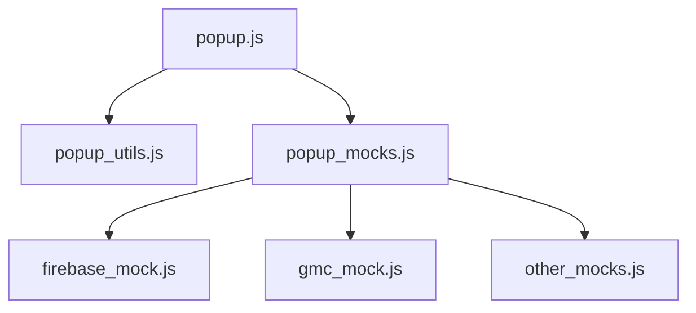
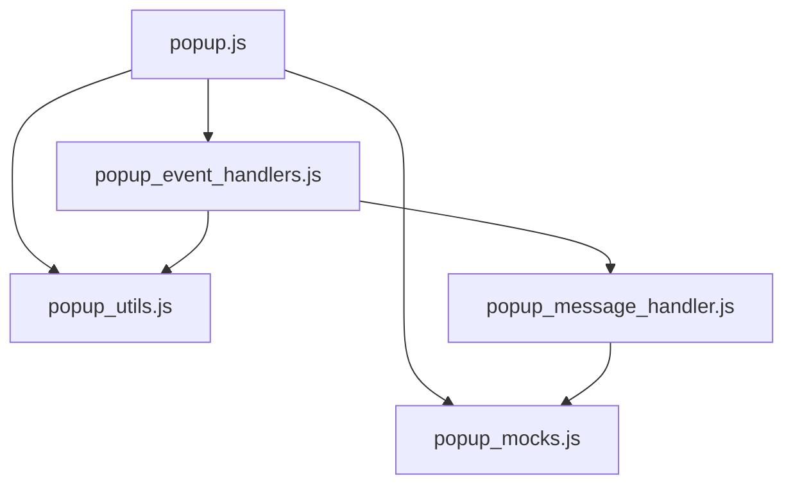

# Recommendations for popup_refactoring_plan.md

After reviewing the codebase and the current state of the AdBrain Feed Manager extension, I have the following recommendations for the popup.js refactoring plan:

## 1. Overall Assessment

The proposed refactoring plan is well-structured and addresses the key issues with the current popup.js file. Breaking down the 1400+ line file into smaller, more focused modules will significantly improve maintainability, testability, and code organization. The incremental approach with clear phases is particularly valuable to minimize risk during refactoring.

## 2. Additional Recommendations

### 2.1 Prioritize Firebase Mock Implementation

Given the current issues with validation history functionality, I recommend prioritizing the extraction and enhancement of the Firebase mock implementation:



- Create a separate `firebase_mock.js` module that provides a more robust mock implementation
- Focus on properly handling Firestore operations, particularly for validation history
- Implement local storage as a fallback for storing validation history when Firebase is not available

### 2.2 Add Feature Flag System

To better manage the transition between mock implementations and real implementations:

```javascript
// Example feature flag system in popup_config.js
export const FEATURES = {
  USE_MOCK_FIREBASE: true,
  USE_MOCK_GMC_API: true,
  USE_SIMPLIFIED_UI: false,
  ENABLE_VALIDATION_HISTORY: true
};
```

- This would allow for gradual replacement of mock implementations
- Makes it easier to test different configurations
- Simplifies debugging by isolating components

### 2.3 Enhance Phase 2 (Extract Mocks)

The current plan for extracting mocks is good, but could be improved:

1. **Split Mock Extraction by Domain**:
   - Extract Firebase mocks first (highest priority due to current issues)
   - Then extract GMC API mocks
   - Finally extract other manager mocks

2. **Improve Mock Initialization**:
   ```javascript
   // In popup_mocks.js
   export function initializeMocks(config = {}) {
     const {
       useMockFirebase = true,
       useMockGmcApi = true,
       // other flags
     } = config;
     
     if (useMockFirebase) {
       initializeFirebaseMocks();
     }
     
     if (useMockGmcApi) {
       initializeGmcApiMocks();
     }
     
     // Initialize other mocks
   }
   ```

3. **Add Mock Versioning**:
   - Include version information in mock implementations
   - Makes it easier to track which mock version is being used
   - Helps with debugging issues related to mock implementations

### 2.4 Add a New Phase for ValidationUIManager Refactoring

Given the current issues with validation history, I recommend adding a specific phase for refactoring the ValidationUIManager:

```
Phase 2.5: ValidationUIManager Refactoring

1. Extract Firebase-related functionality into a separate module
2. Implement a more robust error handling system
3. Add fallback mechanisms for when Firebase is not available
4. Improve the validation history UI
```

This would help address the current issues with validation history while also making the code more maintainable.

### 2.5 Enhance Testing Strategy

The current testing strategy is good, but could be improved:

1. **Add Automated Tests**:
   - Create unit tests for utility functions
   - Add integration tests for critical flows (validation, history loading)
   - Implement snapshot testing for UI components

2. **Create Test Fixtures**:
   - Prepare sample CSV data for testing
   - Create mock validation results for testing UI components
   - Set up test environments for different configurations

3. **Add Regression Testing**:
   - After each phase, test all previously working functionality
   - Document any regressions and fix them before proceeding

## 3. Implementation Considerations

### 3.1 Address Current Issues First

Before starting the refactoring, I recommend fixing the current issues with validation history:

1. Fix the loadValidationHistoryFromFirestore method in ValidationUIManager
2. Enhance the mock Firebase implementation to properly handle Firestore operations
3. Add better error handling for Firebase operations

This will provide a more stable foundation for the refactoring.

### 3.2 Module Dependencies

When refactoring, carefully manage dependencies between modules:



- Avoid circular dependencies
- Use dependency injection where appropriate
- Consider using a simple dependency container for managing complex dependencies

### 3.3 Backward Compatibility

Ensure backward compatibility during the refactoring:

- Maintain the same public API for PopupManager
- Keep the same event handling behavior
- Ensure the UI behaves the same way after refactoring

## 4. Phased Implementation Plan (Revised)

### Phase 1: Extract Utilities (Unchanged)
- Create popup_utils.js
- Move debounce and updateCharCount functions
- Update references

### Phase 2: Extract Firebase Mocks
- Create firebase_mock.js
- Enhance Firebase mock implementation
- Fix validation history functionality

### Phase 3: Extract Other Mocks
- Create gmc_mock.js and other_mocks.js
- Move remaining mock implementations
- Update references

### Phase 4: Refactor ValidationUIManager
- Extract Firebase-related functionality
- Improve error handling
- Add fallback mechanisms

### Phase 5: Extract Event Handlers and Message Handling (Optional)
- Create popup_event_handlers.js and popup_message_handler.js
- Move complex event handling logic
- Update references

## 5. Conclusion

The proposed refactoring plan is solid, but with these enhancements, it will better address the current issues with the codebase while also improving maintainability and testability. The focus on Firebase mock implementation and validation history functionality will help resolve the most pressing issues first, providing a more stable foundation for the rest of the refactoring.

By implementing these recommendations, the AdBrain Feed Manager extension will be better positioned for the implementation of Pro features and future enhancements.