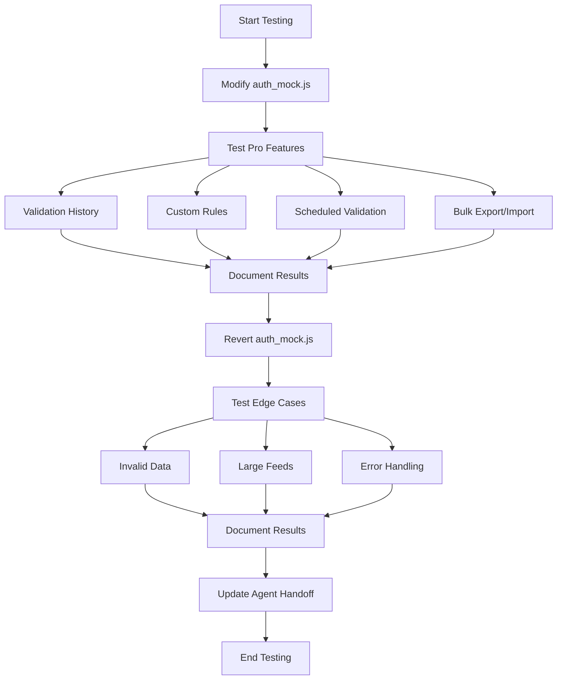

# AdBrain Feed Manager Testing Plan Implementation

## Overview

This document outlines the implementation plan for testing the AdBrain Feed Manager extension, focusing on Pro features and edge cases. This plan is based on the requirements specified in `front_end_testing_results.md`.

## Testing Priorities

1. Test Pro features with mock free account
2. Test edge cases
3. Document all results in front_end_testing_results.md

## 1. Pro Features Testing

### Step 1: Modify auth_mock.js
- Change `this.isProUser = true;` to `this.isProUser = false;` in the constructor (line 25)
- This will simulate a free user experience

### Step 2: Test Validation History Limitation
- Verify that free users can only see validation history from the last 7 days
- Check if older entries are hidden or show an upgrade prompt
- Document the behavior with screenshots

### Step 3: Test Custom Validation Rules
- Navigate to the Custom Rules section (if available)
- Verify that free users see upgrade prompts when attempting to create or modify rules
- Document the UI elements and messaging

### Step 4: Test Scheduled Validation
- Attempt to set up scheduled validation
- Verify that free users see upgrade prompts
- Document the UI elements and messaging

### Step 5: Test Bulk Export/Import
- Attempt to use bulk export/import features
- Verify that free users see upgrade prompts
- Document the UI elements and messaging

### Step 6: Revert auth_mock.js
- Change `this.isProUser = false;` back to `this.isProUser = true;`
- Verify that Pro features are accessible again

## 2. Edge Case Testing

### Step 1: Test with Invalid Data
- **Empty Feed**: Upload an empty CSV file and observe the error handling
- **Malformed Data**: Upload a CSV with incorrect formatting and verify error messages
- **Missing Required Fields**: Upload a CSV missing critical fields (e.g., title, description) and check validation

### Step 2: Test with Large Feeds
- Create and upload a CSV with >1000 rows
- Monitor performance and memory usage
- Verify that pagination or virtualization works correctly
- Check if validation still functions properly with large datasets

### Step 3: Test Error Handling
- **Network Errors**: Simulate offline mode and verify appropriate error messages
- **Firebase Errors**: Test with invalid authentication to trigger Firebase errors
- **Missing Dependencies**: Modify feature flags to simulate missing dependencies

## 3. Documentation

### Step 1: Update front_end_testing_results.md
- Document each test case using the specified format:
  - Test Case ID and Description
  - Steps Performed
  - Expected Result
  - Actual Result
  - Issues Found (if any)
  - Recommendations

### Step 2: Update Agent Handoff Documentation
- Summarize work completed
- Document current status of testing
- Provide explicit next steps for the following agent

## Testing Workflow



## Pro Feature Gating

```mermaid
flowchart TD
    A[User Account] --> B{Is Pro User?}
    B -->|Yes| C[Full Access]
    B -->|No| D[Limited Access]
    C --> C1[Unlimited History]
    C --> C2[Custom Rules]
    C --> C3[Scheduled Validation]
    C --> C4[Bulk Export/Import]
    D --> D1[7-Day History Limit]
    D --> D2[Upgrade Prompt for Custom Rules]
    D --> D3[Upgrade Prompt for Scheduled Validation]
    D --> D4[Upgrade Prompt for Bulk Export/Import]